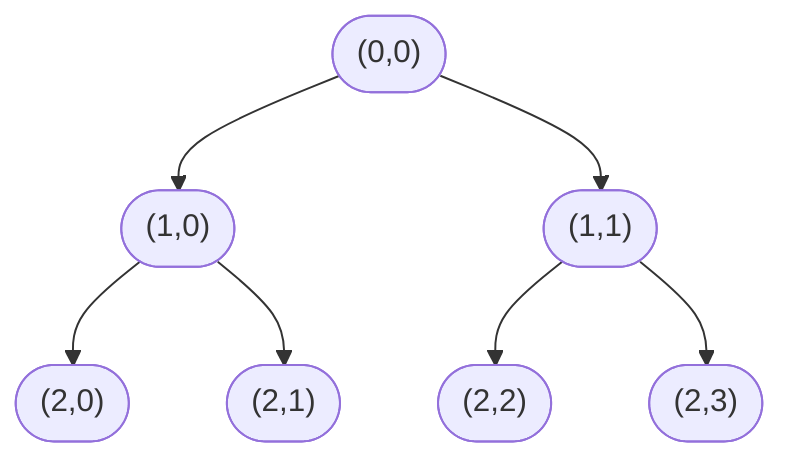

## Binary Merkle Trees

Given a binary tree:

The single top node is called the root, the lowest nodes are called leaves and the remaining nodes are called intermediate nodes. Layers are counted zero based from the root, called the depth. The number of layers is called the depth of the tree. The nodes are numbered zero-based left-to-right and top-to-bottom called their index.

## Index calculus

In addition to the index, we can also identify the nodes by their depth and offset from the left:

